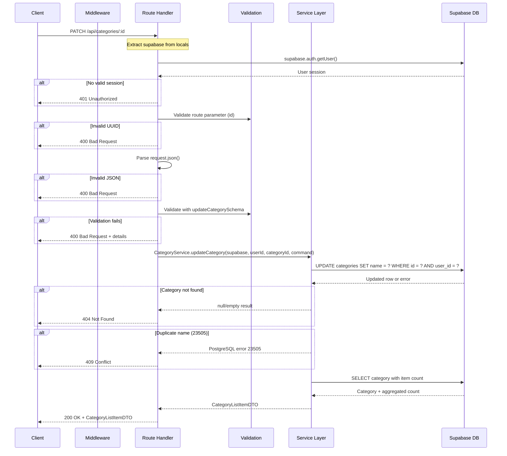

# API Endpoint Implementation Plan: Update Category

## 1. Endpoint Overview

Updates an existing category name for the authenticated user. This endpoint allows users to rename their categories while maintaining referential integrity with existing items. The endpoint validates input, checks for duplicate names (case-insensitive), and returns the updated category with its current item count.

**Key Features:**
- Updates category name only (single field update)
- Validates name format and uniqueness
- Returns updated category with computed item count
- Enforces user ownership through RLS policies
- Prevents duplicate category names per user (case-insensitive)

## 2. Request Details

### HTTP Method
`PATCH`

### URL Structure
```
/api/categories/:id
```

### Route Parameters

| Parameter | Type | Required | Validation | Description |
|-----------|------|----------|------------|-------------|
| `id` | UUID | Yes | Must be valid UUID format | Unique identifier of the category to update |

### Query Parameters
None

### Request Headers
```
Content-Type: application/json
Cookie: sb-access-token=... (Supabase session)
```

### Request Body

```typescript
{
  name: string // Required, 1-255 characters, trimmed, non-whitespace
}
```

**Validation Rules:**
- `name` is required (cannot be null or undefined)
- `name` must be a string type
- `name` must be between 1 and 255 characters after trimming
- `name` cannot be only whitespace
- `name` will be automatically trimmed of leading/trailing whitespace
- `name` must be unique per user (case-insensitive)

**Example Request:**
```json
{
  "name": "Camping & Outdoor Gear"
}
```

## 3. Used Types

### DTOs (from `src/types.ts`)

**UpdateCategoryCommand** - Request payload
```typescript
export type UpdateCategoryCommand = Pick<TablesUpdate<"categories">, "name">;
```

**CategoryListItemDTO** - Response payload
```typescript
export interface CategoryListItemDTO {
  id: Category["id"];
  name: Category["name"];
  itemCount: number;
  createdAt: Category["created_at"];
  updatedAt: Category["updated_at"];
}
```

**ErrorResponseDTO** - Error responses
```typescript
export interface ErrorResponseDTO {
  error: {
    code: string;
    message: string;
    details?: {
      field: string;
      message: string;
    }[];
  };
}
```

### Validation Schemas (to be created in `src/lib/validation/category.schema.ts`)

**updateCategorySchema** - Request body validation
```typescript
export const updateCategorySchema = z.object({
  name: z
    .string({
      required_error: 'Name is required',
      invalid_type_error: 'Name must be a string',
    })
    .min(1, 'Name must be between 1 and 255 characters')
    .max(255, 'Name must be between 1 and 255 characters')
    .refine(
      (val) => val.trim().length > 0,
      'Name cannot be only whitespace'
    )
    .transform((val) => val.trim()),
});

export type UpdateCategorySchema = z.infer<typeof updateCategorySchema>;
```

**categoryIdParamSchema** - Route parameter validation
```typescript
export const categoryIdParamSchema = z.object({
  id: z.string().uuid('Invalid category ID format'),
});

export type CategoryIdParamSchema = z.infer<typeof categoryIdParamSchema>;
```

## 4. Response Details

### Success Response (200 OK)

**Status Code:** `200 OK`

**Content-Type:** `application/json`

**Body Structure:**
```json
{
  "id": "550e8400-e29b-41d4-a716-446655440000",
  "name": "Camping & Outdoor Gear",
  "itemCount": 25,
  "createdAt": "2026-01-05T12:00:00Z",
  "updatedAt": "2026-01-20T11:30:00Z"
}
```

**Notes:**
- `updatedAt` is automatically updated by database trigger
- `itemCount` is computed dynamically from the `items` table
- Response includes complete category information

### Error Responses

#### 401 Unauthorized
```json
{
  "error": {
    "code": "UNAUTHORIZED",
    "message": "Authentication required"
  }
}
```

**When:** User is not authenticated or session is expired

#### 400 Bad Request - Invalid JSON
```json
{
  "error": {
    "code": "VALIDATION_ERROR",
    "message": "Invalid JSON payload"
  }
}
```

**When:** Request body is not valid JSON

#### 400 Bad Request - Invalid Route Parameter
```json
{
  "error": {
    "code": "VALIDATION_ERROR",
    "message": "Invalid category ID format"
  }
}
```

**When:** Category ID is not a valid UUID

#### 400 Bad Request - Invalid Name
```json
{
  "error": {
    "code": "VALIDATION_ERROR",
    "message": "Validation failed",
    "details": [
      {
        "field": "name",
        "message": "Name must be between 1 and 255 characters"
      }
    ]
  }
}
```

**When:** Name validation fails (empty, too long, whitespace only)

#### 404 Not Found
```json
{
  "error": {
    "code": "NOT_FOUND",
    "message": "Category not found"
  }
}
```

**When:** 
- Category with the given ID doesn't exist
- Category exists but belongs to a different user (RLS policy blocks access)

#### 409 Conflict
```json
{
  "error": {
    "code": "CONFLICT",
    "message": "A category with this name already exists"
  }
}
```

**When:** Another category with the same name (case-insensitive) already exists for this user

#### 500 Internal Server Error
```json
{
  "error": {
    "code": "INTERNAL_ERROR",
    "message": "An unexpected error occurred"
  }
}
```

**When:** Unexpected database or server error occurs

## 5. Data Flow

### High-Level Flow
```
1. Client sends PATCH request → /api/categories/:id
2. Middleware extracts Supabase client
3. Route handler validates authentication
4. Route handler validates route parameter (id)
5. Route handler parses and validates request body
6. Route handler creates UpdateCategoryCommand
7. Service layer updates category in database
8. Service layer fetches updated category with item count
9. Route handler returns CategoryListItemDTO
```

### Detailed Data Flow



### Database Operations

**1. Authentication Check**
```sql
-- Automatic via supabase.auth.getUser()
SELECT auth.uid();
```

**2. Update Category**
```sql
-- With RLS policy enforcement
UPDATE categories
SET 
  name = $1,
  updated_at = NOW() -- Trigger handles this
WHERE 
  id = $2 
  AND user_id = auth.uid()
RETURNING *;
```

**3. Fetch Updated Category with Item Count**
```sql
-- Via Supabase query builder
SELECT 
  c.id,
  c.name,
  c.created_at,
  c.updated_at,
  COUNT(i.id) as item_count
FROM categories c
LEFT JOIN items i ON i.category_id = c.id
WHERE c.id = $1 AND c.user_id = auth.uid()
GROUP BY c.id;
```

**Note:** RLS policies automatically enforce `user_id = auth.uid()` constraint, providing defense in depth.

## 6. Security Considerations

### Authentication & Authorization

1. **Session Validation**
   - Verify user session using `supabase.auth.getUser()`
   - Reject requests without valid session (401 Unauthorized)
   - Session managed via HTTP-only cookies by Supabase

2. **Row-Level Security (RLS)**
   - Database enforces user ownership at the data layer
   - Users can only update categories where `user_id = auth.uid()`
   - Attempting to update another user's category results in 404 (not 403 to avoid information disclosure)

3. **Authorization Flow**
   ```typescript
   // RLS Policy (database level)
   CREATE POLICY "Users can update own categories"
     ON categories FOR UPDATE
     USING (auth.uid() = user_id)
     WITH CHECK (auth.uid() = user_id);
   ```

### Input Validation & Sanitization

1. **Route Parameter Validation**
   - Validate `id` is a valid UUID format before database query
   - Prevents malformed UUIDs from reaching database
   - Uses Zod schema for type-safe validation

2. **Request Body Validation**
   - Validate all fields with Zod schemas before processing
   - Automatic type coercion and transformation (trim whitespace)
   - Reject requests with invalid or missing required fields

3. **SQL Injection Prevention**
   - Supabase client uses parameterized queries automatically
   - No raw SQL construction from user input
   - All values properly escaped by the client library

4. **Name Sanitization**
   - Automatic trimming of leading/trailing whitespace
   - Length constraints enforced (1-255 characters)
   - Empty string and whitespace-only names rejected

### Data Integrity

1. **Unique Constraint Enforcement**
   - Database unique index on `(user_id, LOWER(name))`
   - Prevents duplicate category names per user (case-insensitive)
   - Concurrent requests handled by database transaction isolation
   - Returns 409 Conflict on violation

2. **Concurrency Safety**
   - PostgreSQL MVCC handles concurrent updates
   - Last write wins (optimistic concurrency)
   - No explicit locking required for MVP

### Security Threats & Mitigations

| Threat | Mitigation |
|--------|-----------|
| **Unauthorized Access** | Session validation + RLS policies |
| **Horizontal Privilege Escalation** | RLS policies prevent accessing other users' data |
| **SQL Injection** | Parameterized queries via Supabase client |
| **XSS via Category Names** | Client-side output encoding (React auto-escapes) |
| **Mass Assignment** | Explicit field selection in command models |
| **Race Conditions** | Database unique constraint + transaction isolation |
| **Information Disclosure** | Generic error messages, no stack traces to client |
| **CSRF** | SameSite cookies + proper CORS configuration |

### Best Practices Applied

- ✅ Validate input at multiple layers (schema, database constraint)
- ✅ Use guard clauses for early returns on error conditions
- ✅ Never expose internal error details to clients
- ✅ Log errors with context for debugging
- ✅ Use TypeScript for compile-time type safety
- ✅ Leverage RLS for defense in depth
- ✅ Follow principle of least privilege

## 7. Error Handling

### Error Handling Strategy

Follow the guard clause pattern with early returns for error conditions:

1. **Authentication Errors** (401)
   - Check user session first
   - Return early if not authenticated

2. **Validation Errors** (400)
   - Validate route parameters
   - Parse request body with try-catch
   - Validate request body with Zod
   - Return validation details to help client fix the request

3. **Not Found Errors** (404)
   - Detect when update returns no rows
   - Could mean category doesn't exist or user doesn't own it
   - Return generic "not found" message (don't leak ownership info)

4. **Conflict Errors** (409)
   - Catch PostgreSQL unique constraint violation (code: 23505)
   - Return user-friendly message about duplicate name

5. **Server Errors** (500)
   - Catch all unexpected errors
   - Log with full context for debugging
   - Return generic error message to client

### Error Handling Code Structure

```typescript
export const PATCH: APIRoute = async ({ request, params, locals }) => {
  try {
    // Guard: Authentication
    const { data: { user }, error: authError } = await supabase.auth.getUser();
    if (authError || !user) {
      return Response(401, 'UNAUTHORIZED', 'Authentication required');
    }

    // Guard: Route parameter validation
    const paramValidation = categoryIdParamSchema.safeParse({ id: params.id });
    if (!paramValidation.success) {
      return Response(400, 'VALIDATION_ERROR', 'Invalid category ID format');
    }

    // Guard: JSON parsing
    let body;
    try {
      body = await request.json();
    } catch {
      return Response(400, 'VALIDATION_ERROR', 'Invalid JSON payload');
    }

    // Guard: Request body validation
    const validation = updateCategorySchema.safeParse(body);
    if (!validation.success) {
      return Response(400, 'VALIDATION_ERROR', 'Validation failed', details);
    }

    // Call service layer
    const category = await CategoryService.updateCategory(...);

    // Guard: Category not found
    if (!category) {
      return Response(404, 'NOT_FOUND', 'Category not found');
    }

    // Happy path
    return Response(200, category);

  } catch (error) {
    // Handle specific errors
    if (error.code === '23505') {
      return Response(409, 'CONFLICT', 'A category with this name already exists');
    }

    // Log and return generic error
    console.error('[PATCH /api/categories/:id] Unexpected error:', error);
    return Response(500, 'INTERNAL_ERROR', 'An unexpected error occurred');
  }
};
```

### Error Logging

Log errors with sufficient context for debugging:

```typescript
console.error('[PATCH /api/categories/:id] Unexpected error:', {
  userId: user?.id || 'unknown',
  categoryId: params.id,
  error: error?.message || 'Unknown error',
  code: error?.code || 'N/A',
  timestamp: new Date().toISOString(),
});
```

**What to Log:**
- Endpoint identifier (HTTP method + path)
- User ID (for user-specific debugging)
- Category ID being updated
- Error message and code
- Timestamp

**What NOT to Log:**
- Sensitive user data
- Full request/response bodies
- Stack traces in production (use error tracking service instead)

### Error Response Format

All errors follow the `ErrorResponseDTO` structure:

```typescript
{
  error: {
    code: string,        // Machine-readable error code
    message: string,     // Human-readable error message
    details?: Array<{    // Optional validation details
      field: string,
      message: string
    }>
  }
}
```

### HTTP Status Code Summary

| Status Code | Error Code | Condition |
|------------|------------|-----------|
| 200 | - | Category successfully updated |
| 400 | VALIDATION_ERROR | Invalid JSON, UUID, or name validation failed |
| 401 | UNAUTHORIZED | User not authenticated |
| 404 | NOT_FOUND | Category doesn't exist or user doesn't own it |
| 409 | CONFLICT | Duplicate category name (case-insensitive) |
| 500 | INTERNAL_ERROR | Unexpected server or database error |

## 8. Performance Considerations

### Database Query Optimization

1. **Index Usage**
   - Primary key index on `categories(id)` for fast lookups
   - Unique index on `categories(user_id, LOWER(name))` for duplicate detection
   - Foreign key index on `items(category_id)` for item count aggregation

2. **Query Efficiency**
   - Single UPDATE query with RETURNING clause (avoids second SELECT)
   - Aggregation query uses LEFT JOIN for item count
   - RLS policies use indexed `user_id` column

3. **Expected Query Plan**
   ```sql
   -- Update query uses primary key index
   Index Scan using categories_pkey on categories
     Filter: (user_id = auth.uid())
   
   -- Item count query uses foreign key index
   HashAggregate
     -> Hash Left Join
          -> Index Scan using categories_pkey
          -> Index Scan using items_category_id_idx
   ```

### Caching Strategy (Future Enhancement)

- No caching in MVP (premature optimization)
- Consider category list caching if performance issues arise
- Invalidate cache on category updates
- Use short TTL (1-5 minutes) to balance freshness and performance

### Response Time Expectations

| Operation | Expected Time | Notes |
|-----------|--------------|-------|
| Authentication check | < 50ms | Session lookup from Supabase |
| Input validation | < 5ms | Zod schema validation in-memory |
| Database UPDATE | < 20ms | Single row update with index |
| Item count query | < 30ms | Aggregation with indexed join |
| **Total (happy path)** | **< 105ms** | End-to-end request processing |

### Scalability Considerations

1. **Single-User Optimization**
   - Queries optimized for per-user scope
   - All indexes include `user_id` for efficient filtering
   - No cross-user queries required

2. **Concurrent Updates**
   - PostgreSQL MVCC handles concurrent requests
   - Unique constraint prevents race conditions
   - No explicit locking needed (last write wins)

3. **Future Scaling Options** (Out of Scope for MVP)
   - Add Redis caching for category lists
   - Implement materialized views for item counts
   - Use database connection pooling (Supabase handles this)
   - Consider read replicas for read-heavy workloads

### Bottleneck Analysis

**Potential Bottlenecks:**
1. Item count aggregation (if user has thousands of categories/items)
   - **Mitigation:** Acceptable for MVP, can denormalize later if needed
2. Database connection overhead
   - **Mitigation:** Supabase connection pooling handles this
3. Network latency to Supabase
   - **Mitigation:** Deploy application in same region as database

**Not a Concern for MVP:**
- Request payload size (single string field)
- Response payload size (small JSON object)
- CPU/memory usage (simple CRUD operation)

## 9. Implementation Steps

### Step 1: Create Validation Schemas

**File:** `src/lib/validation/category.schema.ts`

Add the following schemas to the existing file:

```typescript
/**
 * Validation schema for category ID route parameter
 * 
 * Enforces:
 * - ID must be a valid UUID format
 */
export const categoryIdParamSchema = z.object({
  id: z.string().uuid('Invalid category ID format'),
});

export type CategoryIdParamSchema = z.infer<typeof categoryIdParamSchema>;

/**
 * Validation schema for updating a category
 * 
 * Enforces:
 * - Name is required and must be a string
 * - Name length between 1 and 255 characters
 * - Name cannot be only whitespace
 * - Automatically trims whitespace from name
 * 
 * Note: Uses same validation rules as createCategorySchema
 */
export const updateCategorySchema = z.object({
  name: z
    .string({
      required_error: 'Name is required',
      invalid_type_error: 'Name must be a string',
    })
    .min(1, 'Name must be between 1 and 255 characters')
    .max(255, 'Name must be between 1 and 255 characters')
    .refine(
      (val) => val.trim().length > 0,
      'Name cannot be only whitespace'
    )
    .transform((val) => val.trim()),
});

export type UpdateCategorySchema = z.infer<typeof updateCategorySchema>;
```

### Step 2: Extend Service Layer

**File:** `src/lib/services/category.service.ts`

Add the following method to the `CategoryService` class:

```typescript
/**
 * Updates an existing category name
 * 
 * Business Rules:
 * - Only the category name can be updated
 * - Category must exist and belong to the authenticated user
 * - New name must be unique per user (case-insensitive)
 * - RLS policies enforce user ownership
 * - Returns updated category with current item count
 * 
 * @param supabase - Supabase client with user session
 * @param userId - ID of the authenticated user
 * @param categoryId - ID of the category to update
 * @param command - Category update command with validated name
 * @returns Updated category as CategoryListItemDTO, or null if not found
 * @throws {Error} If new name conflicts with existing category (code: '23505')
 * @throws {Error} If database operation fails
 */
static async updateCategory(
  supabase: SupabaseClient<Database>,
  userId: string,
  categoryId: string,
  command: UpdateCategoryCommand
): Promise<CategoryListItemDTO | null> {
  // Step 1: Update category name
  // RLS policy automatically enforces user_id = auth.uid()
  const { data: updateData, error: updateError } = await supabase
    .from('categories')
    .update({
      name: command.name, // Already trimmed by Zod transform
    })
    .eq('id', categoryId)
    .eq('user_id', userId) // Explicit filter (RLS also enforces this)
    .select()
    .single();

  // Handle database errors - let route handler determine response code
  if (updateError) {
    // PostgreSQL error code 23505 = unique constraint violation
    if (updateError.code === '23505') {
      throw updateError;
    }
    throw updateError;
  }

  // Category not found or user doesn't own it (RLS blocked the update)
  if (!updateData) {
    return null;
  }

  // Step 2: Fetch updated category with item count
  // Using the same pattern as listCategories
  const { data: categoryData, error: fetchError } = await supabase
    .from('categories')
    .select('id, name, created_at, updated_at, items(count)')
    .eq('id', categoryId)
    .eq('user_id', userId)
    .single();

  if (fetchError || !categoryData) {
    // This shouldn't happen since we just updated it, but handle defensively
    throw fetchError || new Error('Category not found after update');
  }

  // Step 3: Transform database row to DTO
  return {
    id: categoryData.id,
    name: categoryData.name,
    itemCount: categoryData.items?.[0]?.count ?? 0,
    createdAt: categoryData.created_at,
    updatedAt: categoryData.updated_at,
  };
}
```

**Alternative Implementation (Single Query):**

For better performance, you can combine update and fetch in one query:

```typescript
static async updateCategory(
  supabase: SupabaseClient<Database>,
  userId: string,
  categoryId: string,
  command: UpdateCategoryCommand
): Promise<CategoryListItemDTO | null> {
  // Update and fetch with item count in single query
  const { data, error } = await supabase
    .from('categories')
    .update({ name: command.name })
    .eq('id', categoryId)
    .eq('user_id', userId)
    .select('id, name, created_at, updated_at, items(count)')
    .single();

  if (error) {
    throw error;
  }

  if (!data) {
    return null;
  }

  return {
    id: data.id,
    name: data.name,
    itemCount: data.items?.[0]?.count ?? 0,
    createdAt: data.created_at,
    updatedAt: data.updated_at,
  };
}
```

### Step 3: Create API Route Handler

**File:** `src/pages/api/categories/[id].ts`

Create a new file with the following content:

```typescript
import type { APIRoute } from 'astro';
import { updateCategorySchema, categoryIdParamSchema } from '../../../lib/validation/category.schema';
import { CategoryService } from '../../../lib/services/category.service';
import type { UpdateCategoryCommand, ErrorResponseDTO, CategoryListItemDTO } from '../../../types';
import { loginTestUser } from '@/lib/utils';

export const prerender = false;

/**
 * PATCH /api/categories/:id
 * 
 * Updates an existing category name for the authenticated user.
 * 
 * Route Parameters:
 * - id: string (UUID) - ID of the category to update
 * 
 * Request Body:
 * - name: string (required, 1-255 characters, trimmed)
 * 
 * Response:
 * - 200: CategoryListItemDTO with updated data
 * - 401: Unauthorized (no valid session)
 * - 400: Bad Request (validation error)
 * - 404: Not Found (category doesn't exist or user doesn't own it)
 * - 409: Conflict (duplicate category name)
 * - 500: Internal Server Error
 */
export const PATCH: APIRoute = async ({ request, params, locals }) => {
  console.log('[PATCH /api/categories/:id] Request received');
  console.log(request);

  try {
    // Step 1: Authentication check (guard clause)
    const supabase = locals.supabase;
    const USER_ID: string = loginTestUser(supabase);
    
    const { data: { user }, error: authError } = await supabase.auth.getUser();

    if (authError || !user) {
      return new Response(
        JSON.stringify({
          error: {
            code: 'UNAUTHORIZED',
            message: 'Authentication required',
          },
        } satisfies ErrorResponseDTO),
        { 
          status: 401, 
          headers: { 'Content-Type': 'application/json' } 
        }
      );
    }

    // Step 2: Validate route parameter (guard clause)
    const paramValidation = categoryIdParamSchema.safeParse({ id: params.id });
    
    if (!paramValidation.success) {
      return new Response(
        JSON.stringify({
          error: {
            code: 'VALIDATION_ERROR',
            message: 'Invalid category ID format',
          },
        } satisfies ErrorResponseDTO),
        { 
          status: 400, 
          headers: { 'Content-Type': 'application/json' } 
        }
      );
    }

    const categoryId = paramValidation.data.id;

    // Step 3: Parse request body (guard clause)
    let body: unknown;
    try {
      body = await request.json();
    } catch {
      return new Response(
        JSON.stringify({
          error: {
            code: 'VALIDATION_ERROR',
            message: 'Invalid JSON payload',
          },
        } satisfies ErrorResponseDTO),
        { 
          status: 400, 
          headers: { 'Content-Type': 'application/json' } 
        }
      );
    }

    // Step 4: Validate request body with Zod schema (guard clause)
    const validation = updateCategorySchema.safeParse(body);
    
    if (!validation.success) {
      const details = validation.error.errors.map((err) => ({
        field: err.path.join('.') || 'name',
        message: err.message,
      }));

      return new Response(
        JSON.stringify({
          error: {
            code: 'VALIDATION_ERROR',
            message: 'Validation failed',
            details,
          },
        } satisfies ErrorResponseDTO),
        { 
          status: 400, 
          headers: { 'Content-Type': 'application/json' } 
        }
      );
    }

    // Step 5: Create command object
    const command: UpdateCategoryCommand = {
      name: validation.data.name, // Already trimmed by Zod
    };

    // Step 6: Call service layer
    const category = await CategoryService.updateCategory(
      supabase,
      USER_ID,
      categoryId,
      command
    );

    // Step 7: Check if category was found (guard clause)
    if (!category) {
      return new Response(
        JSON.stringify({
          error: {
            code: 'NOT_FOUND',
            message: 'Category not found',
          },
        } satisfies ErrorResponseDTO),
        { 
          status: 404, 
          headers: { 'Content-Type': 'application/json' } 
        }
      );
    }

    // Step 8: Return success response (happy path)
    return new Response(
      JSON.stringify(category),
      { 
        status: 200, 
        headers: { 'Content-Type': 'application/json' } 
      }
    );

  } catch (error: any) {
    // Handle unique constraint violation (duplicate category name)
    if (error?.code === '23505') {
      return new Response(
        JSON.stringify({
          error: {
            code: 'CONFLICT',
            message: 'A category with this name already exists',
          },
        } satisfies ErrorResponseDTO),
        { 
          status: 409, 
          headers: { 'Content-Type': 'application/json' } 
        }
      );
    }

    // Log unexpected errors with context for debugging
    console.error('[PATCH /api/categories/:id] Unexpected error:', {
      userId: error?.user?.id || 'unknown',
      categoryId: params?.id || 'unknown',
      error: error?.message || 'Unknown error',
      code: error?.code || 'N/A',
      timestamp: new Date().toISOString(),
    });

    // Return generic error response (never expose internal details)
    return new Response(
      JSON.stringify({
        error: {
          code: 'INTERNAL_ERROR',
          message: 'An unexpected error occurred',
        },
      } satisfies ErrorResponseDTO),
      { 
        status: 500, 
        headers: { 'Content-Type': 'application/json' } 
      }
    );
  }
};
```

### Step 4: Test the Implementation

#### Manual Testing with curl

**Test 1: Successful Update**
```bash
curl -X PATCH http://localhost:4321/api/categories/{valid-uuid} \
  -H "Content-Type: application/json" \
  -H "Cookie: sb-access-token=your-token" \
  -d '{"name": "Updated Category Name"}'

# Expected: 200 OK with CategoryListItemDTO
```

**Test 2: Invalid UUID**
```bash
curl -X PATCH http://localhost:4321/api/categories/invalid-id \
  -H "Content-Type: application/json" \
  -H "Cookie: sb-access-token=your-token" \
  -d '{"name": "Updated Name"}'

# Expected: 400 Bad Request - "Invalid category ID format"
```

**Test 3: Invalid Name (Empty)**
```bash
curl -X PATCH http://localhost:4321/api/categories/{valid-uuid} \
  -H "Content-Type: application/json" \
  -H "Cookie: sb-access-token=your-token" \
  -d '{"name": ""}'

# Expected: 400 Bad Request - Validation failed
```

**Test 4: Invalid Name (Too Long)**
```bash
curl -X PATCH http://localhost:4321/api/categories/{valid-uuid} \
  -H "Content-Type: application/json" \
  -H "Cookie: sb-access-token=your-token" \
  -d '{"name": "'$(printf 'a%.0s' {1..300})'"}'

# Expected: 400 Bad Request - Validation failed
```

**Test 5: Duplicate Name**
```bash
# Assumes another category with name "Existing Category" exists
curl -X PATCH http://localhost:4321/api/categories/{valid-uuid} \
  -H "Content-Type: application/json" \
  -H "Cookie: sb-access-token=your-token" \
  -d '{"name": "Existing Category"}'

# Expected: 409 Conflict - "A category with this name already exists"
```

**Test 6: Category Not Found**
```bash
curl -X PATCH http://localhost:4321/api/categories/00000000-0000-0000-0000-000000000000 \
  -H "Content-Type: application/json" \
  -H "Cookie: sb-access-token=your-token" \
  -d '{"name": "Updated Name"}'

# Expected: 404 Not Found - "Category not found"
```

**Test 7: Unauthorized**
```bash
curl -X PATCH http://localhost:4321/api/categories/{valid-uuid} \
  -H "Content-Type: application/json" \
  -d '{"name": "Updated Name"}'

# Expected: 401 Unauthorized - "Authentication required"
```

**Test 8: Case-Insensitive Duplicate Detection**
```bash
# Assumes another category with name "tools" exists
curl -X PATCH http://localhost:4321/api/categories/{valid-uuid} \
  -H "Content-Type: application/json" \
  -H "Cookie: sb-access-token=your-token" \
  -d '{"name": "TOOLS"}'

# Expected: 409 Conflict - Database enforces case-insensitive uniqueness
```

#### Integration Testing Checklist

- [ ] Can update category with valid name
- [ ] Returns updated category with correct itemCount
- [ ] Rejects invalid UUID format
- [ ] Rejects empty name
- [ ] Rejects name > 255 characters
- [ ] Rejects whitespace-only name
- [ ] Trims leading/trailing whitespace from name
- [ ] Prevents duplicate names (exact match)
- [ ] Prevents duplicate names (case-insensitive)
- [ ] Returns 404 for non-existent category
- [ ] Returns 404 for other user's category
- [ ] Returns 401 without authentication
- [ ] Updates `updated_at` timestamp automatically
- [ ] Returns current item count after update
- [ ] Handles concurrent updates correctly

### Step 5: Verify Database Constraints

Ensure the database has the necessary constraints:

**Unique Constraint (should already exist from database plan):**
```sql
-- Verify unique index exists
SELECT indexname, indexdef 
FROM pg_indexes 
WHERE tablename = 'categories' 
  AND indexname = 'idx_categories_user_name_unique';

-- Expected result:
-- idx_categories_user_name_unique | CREATE UNIQUE INDEX idx_categories_user_name_unique 
--   ON categories USING btree (user_id, lower(name::text))
```

**Updated_at Trigger (should already exist):**
```sql
-- Verify trigger exists
SELECT trigger_name, event_manipulation, event_object_table
FROM information_schema.triggers
WHERE event_object_table = 'categories'
  AND trigger_name = 'update_categories_updated_at';

-- Expected result:
-- update_categories_updated_at | UPDATE | categories
```

### Step 6: Update Frontend Components (If Needed)

If you have frontend components that interact with categories, update them to support the update functionality:

**Example: Add edit functionality to CategoriesList component**

```typescript
// In CategoriesList.tsx or similar component
const handleUpdateCategory = async (id: string, newName: string) => {
  try {
    const response = await fetch(`/api/categories/${id}`, {
      method: 'PATCH',
      headers: {
        'Content-Type': 'application/json',
      },
      body: JSON.stringify({ name: newName }),
    });

    if (!response.ok) {
      const error = await response.json();
      throw new Error(error.error.message);
    }

    const updatedCategory = await response.json();
    // Update local state with updatedCategory
    // Show success message
  } catch (error) {
    // Show error message to user
  }
};
```

### Step 7: Documentation

Update API documentation to include the new endpoint:

**File:** `README.md` or API documentation file

```markdown
### Update Category

**Endpoint:** `PATCH /api/categories/:id`

**Description:** Updates an existing category name

**Authentication:** Required

**Request:**
- **Route Parameters:**
  - `id` (UUID): Category ID
- **Body:**
  ```json
  {
    "name": "New Category Name"
  }
  ```

**Response (200 OK):**
```json
{
  "id": "uuid",
  "name": "New Category Name",
  "itemCount": 25,
  "createdAt": "2026-01-05T12:00:00Z",
  "updatedAt": "2026-01-27T10:15:00Z"
}
```

**Error Responses:**
- `400` - Invalid input (name validation failed, invalid UUID)
- `401` - Authentication required
- `404` - Category not found
- `409` - Category name already exists
- `500` - Internal server error
```

### Step 8: Monitoring and Logging (Optional)

Set up monitoring for the endpoint:

1. **Error Tracking**
   - Monitor 4xx and 5xx error rates
   - Alert on high error rates or repeated failures
   - Track common validation errors to improve UX

2. **Performance Monitoring**
   - Track endpoint response times
   - Monitor database query performance
   - Set up alerts for slow queries (> 200ms)

3. **Usage Analytics**
   - Track endpoint usage frequency
   - Monitor peak usage times
   - Identify usage patterns for optimization

### Implementation Checklist

- [ ] Step 1: Create validation schemas (`categoryIdParamSchema`, `updateCategorySchema`)
- [ ] Step 2: Extend `CategoryService` with `updateCategory` method
- [ ] Step 3: Create API route handler `src/pages/api/categories/[id].ts`
- [ ] Step 4: Test all success and error scenarios
- [ ] Step 5: Verify database constraints are in place
- [ ] Step 6: Update frontend components (if applicable)
- [ ] Step 7: Update API documentation
- [ ] Step 8: Set up monitoring (optional)
- [ ] Final: Code review and merge

### Estimated Implementation Time

- **Validation Schemas:** 10 minutes
- **Service Layer:** 15 minutes
- **API Route Handler:** 20 minutes
- **Testing:** 30 minutes
- **Documentation:** 10 minutes
- **Total:** ~90 minutes

---

## Notes for Developers

### Key Design Decisions

1. **Single Field Update:** Only the `name` field can be updated. This simplifies validation and reduces the risk of unintended changes.

2. **Case-Insensitive Uniqueness:** The database unique constraint on `LOWER(name)` ensures that "Tools" and "tools" are considered duplicates.

3. **404 vs 403:** When a user tries to update another user's category, we return 404 instead of 403 to avoid leaking information about the existence of categories.

4. **Null Return vs Exception:** The service layer returns `null` when a category is not found, allowing the route handler to determine the appropriate HTTP status code (404).

5. **Two-Query Approach:** We use separate UPDATE and SELECT queries to ensure we get the correct item count after the update. An alternative single-query approach is also provided.

6. **Guard Clause Pattern:** The route handler uses guard clauses with early returns for all error conditions, keeping the happy path at the end for better readability.

### Common Pitfalls to Avoid

1. **Don't forget to trim whitespace:** The Zod schema handles this with `.transform((val) => val.trim())`

2. **Don't expose internal errors:** Always return generic error messages to the client, never stack traces or database errors

3. **Don't check user_id separately:** RLS policies handle this automatically, but we include it explicitly for clarity and defense in depth

4. **Don't update without validating:** Always validate input with Zod before calling the service layer

5. **Don't assume the category exists:** Always check for null return from the service layer

### Future Enhancements (Out of Scope)

- Bulk category updates
- Category description field
- Category icons/colors
- Category sorting/ordering
- Audit trail for category changes
- Undo/redo functionality
- Category templates
- Batch operations API
